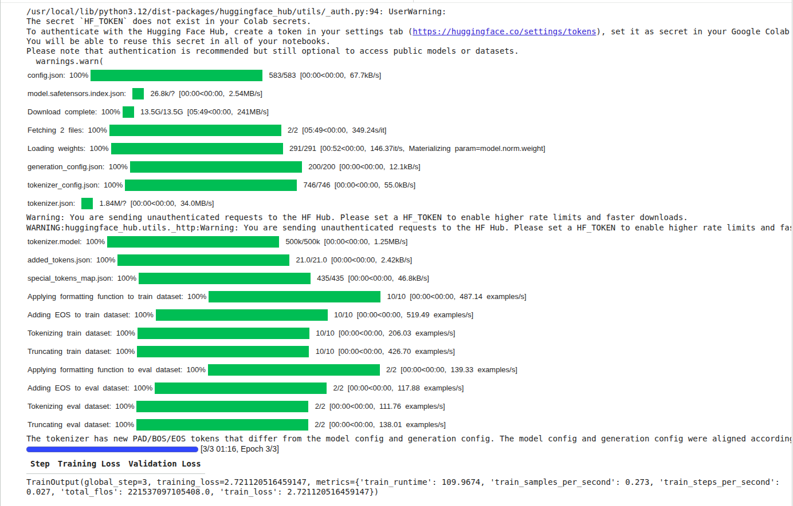
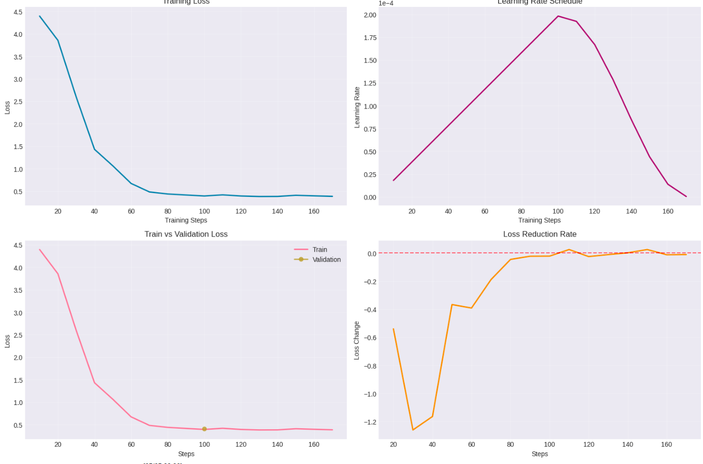
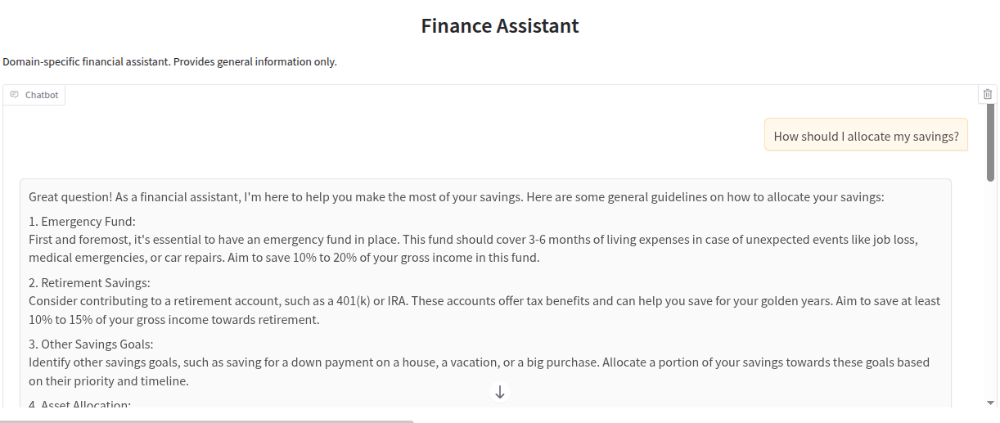

# Finance Assistant: Domain-Specific LLM Fine-Tuning

## Google Colab Notebook
You can open and run this notebook directly in Google Colab:
[Open in Colab](https://colab.research.google.com/drive/1baVqY65ubGkCqNmAlqdrRN9P7gb3TZK2?usp=sharing)

## Hosted Chatbot Demo

Try the Finance Assistant chatbot live at:

[Finance Assistant Chatbot (Hugging Face Spaces)](https://huggingface.co/spaces/isaacm26/finance-assistant-app)

---

## Overview
This project demonstrates fine-tuning a pre-trained language model for a finance assistant chatbot using the FinanceQA dataset from Hugging Face. The notebook is designed for Google Colab and leverages parameter-efficient fine-tuning (LoRA) to adapt google/gemma-3-1b-it to the finance domain. The workflow includes secure authentication for gated datasets, modular code structure, model training, evaluation, and deployment via a modern Gradio web interface with custom CSS.

## Project Structure
- **configs/**: Model and tokenizer configuration files
- **docs/**: Documentation images and demo screenshots
- **models/**: Model weights and adapter files
- **outputs/**: Training curves and evaluation results
- **Finance_Assistant.ipynb**: Main notebook
- **README.md**: Project documentation

## Example Visualizations

Below are example visualizations generated from the notebook:

*Training Curves: Shows the reduction in loss as training progresses.*

## Chatbot Demo Example

The notebook includes a Gradio chatbot interface. Here is a sample prompt and response:

**Prompt:** How should I allocate my savings?

**Response:**

1. Emergency Fund:
First and foremost, it's essential to have an emergency fund in place. This fund should cover 3-6 months of living expenses in case of unexpected events like job loss, medical emergencies, or car repairs. Aim to save 10% to 20% of your gross income in this fund.

2. Retirement Savings:
Consider contributing to a retirement account, such as a 401(k) or IRA. These accounts offer tax benefits and can help you save for your golden years. Aim to save at least 10% to 15% of your gross income towards retirement.

3. Other Savings Goals:
Identify other savings goals, such as saving for a down payment on a house, a vacation, or a big purchase. Allocate a portion of your savings towards these goals based on their priority and timeline.

4. Asset Allocation:
Diversify your savings across different asset classes, such as stocks, bonds, and real estate. This can help reduce risk and increase potential returns. Aim to allocate 5% to 10% of your savings towards each asset class, depending on your risk tolerance and financial goals.

## Workflow Summary
1. **Install Dependencies**: All required libraries are installed for Colab compatibility.
2. **Import Libraries & Environment Setup**: Essential packages for modeling, visualization, and web deployment are imported.
3. **Dataset Preparation**: The FinanceQA dataset is loaded directly from Hugging Face, with authentication for gated access. No local JSON files required.
4. **Function & Class Definitions**: Modular helper functions and callback classes are defined for training, evaluation, and inference.
5. **Model Setup & Fine-Tuning**: google/gemma-3-1b-it is loaded and fine-tuned using LoRA. Hyperparameters are documented.
6. **Evaluation & Visualization**: Training and validation loss, learning rate, and perplexity are tracked and visualized. BLEU score is computed for additional evaluation. Visualizations include:
   - Training Loss Curve
   - Learning Rate Schedule
   - Train vs Validation Loss
   - Loss Reduction Rate
7. **Inference & Demo**: The fine-tuned model is tested with sample questions and deployed via a modular Gradio chatbot interface with custom CSS.
8. **Experiment Table**: Hyperparameter experiments, GPU usage, and training time are summarized.
9. **Qualitative Comparison**: Responses from the base and fine-tuned models are compared for key questions.
10. **Methodology & Insights**: The approach and key findings are documented.

## Key Features
- Parameter-efficient fine-tuning (LoRA) for resource-constrained environments
- FinanceQA dataset from Hugging Face for domain relevance
- Secure authentication for gated dataset access and model upload (token prompt)
- google/gemma-3-1b-it as base model
- Modular Gradio UI with custom CSS
- Quantitative (loss, perplexity, BLEU) and qualitative evaluation
- Experiment tracking for reproducibility

## Instructions
1. Open the notebook in Google Colab.
2. Run all cells sequentially for a complete workflow.
3. When prompted, enter your Hugging Face token for gated dataset access and model upload.
4. Review experiment results and evaluation metrics.
5. Interact with the deployed chatbot for demonstration.

## Requirements
- Google Colab (recommended)
- Python 3.8+
- Packages: torch, transformers, datasets, peft, trl, gradio, matplotlib, seaborn, scikit-learn, nltk, bitsandbytes

## Methodology
- Fine-tuning is performed using LoRA to efficiently adapt google/gemma-3-1b-it to the finance domain.
- The dataset consists of instruction-response pairs from FinanceQA covering a range of finance topics.
- Model performance is evaluated using loss, perplexity, BLEU, and qualitative comparisons.
- The modular Gradio interface enables easy user interaction and demonstration.

## Insights
- Domain adaptation with FinanceQA improves response quality and relevance for finance queries.
- LoRA enables efficient training on limited hardware.
- Secure token handling is essential for gated datasets and uploads.
- Hyperparameter tuning impacts both performance and resource usage.
- Combining quantitative and qualitative metrics provides a comprehensive evaluation.

## License
This project is for educational purposes. Please review the license terms of any pre-trained models and datasets used.

## Contact
For questions or feedback, please contact the project maintainer.